# Snapshot del diseño provisional (2026-09) — conservado por si acaso

> **Qué es.** Fotografía completa del design system que GameVision usa HOY, tomada el 01/10/2026
> justo antes del [re-anclaje al sistema nuevo (ADR-0010)](../metodologia/adr/0010-reanclaje-adelantado-fuente-recibida.md).
> El propietario quiere conservar el contexto del diseño actual («no me gusta, pero molaría tener
> un backup») antes de sustituirlo.
>
> **Qué NO es.** No es la fuente de verdad del look actual — esa sigue siendo [`DESIGN.md`](../../DESIGN.md)
> hasta que termine el re-anclaje. Este documento es el **álbum de despedida**: referencia visual +
> índice de dónde vive todo, para poder consultar o incluso restaurar el look viejo.

## Cómo restaurar este diseño si algún día se quiere

Tres capas de backup, de más fina a más gruesa:

1. **Tag `diseno-provisional-2026-09`** — commit exacto con el look viejo funcionando.
   `git checkout diseno-provisional-2026-09` y compilar: la app entera tal cual estaba el 01/10.
2. **Branch `backup/design-provisional-2026-09`** — lo mismo que el tag, en forma de rama
   (útil si algún día se quiere evolucionar el look viejo en paralelo).
3. **Este documento + [`DESIGN.md`](../../DESIGN.md)** — el contexto escrito: qué era, cómo
   funcionaba, dónde estaban los tokens.

El re-anclaje ocurre en commits *posteriores* a ese tag en `master`: nada del trabajo nuevo
contamina la rama de backup.

## La identidad en una frase

**"Monocromo cálido + spot verde ácido, cinematográfico editorial."** Fondos en grises casi-neutros
(ligeramente cálidos), tipografía display grande en **Space Grotesk**, y **un único verde ácido
`#C8F135`** como acento interactivo. El modo oscuro usa negros cálidos (`#141414`/`#0D0D0D`) con el
mismo verde. Cero gradientes; las tarjetas de superficie llevan bordes suaves; skeletons en lugar
de spinners.

## Tokens tal como están implementados (fuente: `ui/designsystem/GVTheme.kt`)

| Rol | Claro | Oscuro |
|---|---|---|
| Fondo / superficie | `#FAFAFA`, `#FFFFFF`, `#F2F2F2`, `#EDEDED` | `#141414`, `#0D0D0D`, `#1A1A1A`, `#1F1F1F`, `#242424`, `#2A2A2A`, `#2E2E2E` |
| Texto | `#1F1F1F`-`#333333` (tinta), `#5A5A5A`/`#8C8C8C` (secundario) | `#FFFFFF`-`#D4D4D4`, `#8C8C8C` (secundario) |
| **Acento interactivo** | **`#C8F135`** (verde ácido) + `#E4FF87` (variante suave) | el mismo verde ácido |
| Acento en superficie oscura / contenedores | `#1E2600`, `#2E3A0A`, `#4A6B00` (verdes oliva profundos) | ídem |
| Error | `#B3261E` / `#FF5449` | ídem |

- **Tipografía:** Space Grotesk (Google Fonts descargable, pesos 400/500/600) en
  [`GVTypography.kt`](../../app/src/main/java/es/androidtfm/gamevision/ui/designsystem/GVTypography.kt).
- **Formas y motion:** [`GVShapes.kt`](../../app/src/main/java/es/androidtfm/gamevision/ui/designsystem/GVShapes.kt)
  y [`GVMotion.kt`](../../app/src/main/java/es/androidtfm/gamevision/ui/designsystem/GVMotion.kt)
  (física de muelles, skeletons, shared transitions).
- **Componentes (14 ficheros):** `GameCard`, `GameCover`, `GVButton`, `GVChip`, `GVSkeleton`,
  `EmptyState`, `OfflineBanner`, `NewsCard`, `RatingBadge`, `FriendAvatar`, `Connectivity` + los 5
  de sistema (tema/tipo/formas/motion/shared).

## Galería — modo claro

| Pantalla | Captura |
|---|---|
| Inicio (noticias) | 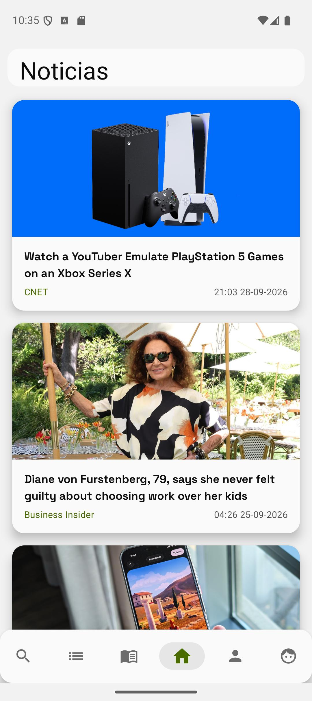 |
| Búsqueda con resultados | 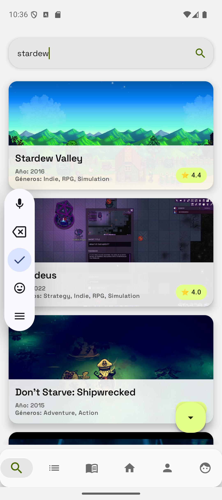 |
| Ficha de juego (con HLTB) | 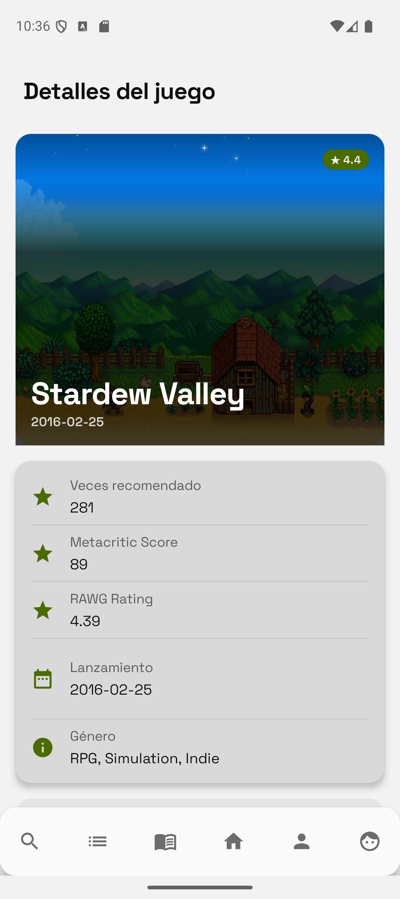 |
| Biblioteca (pestañas de estados) | 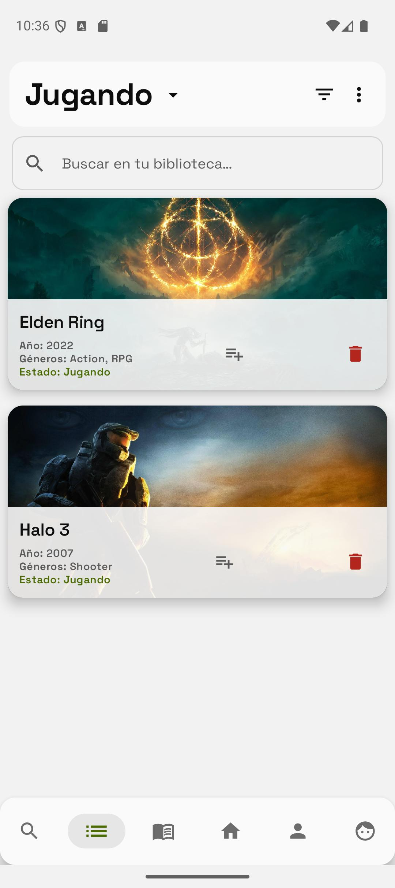 |
| Diario | 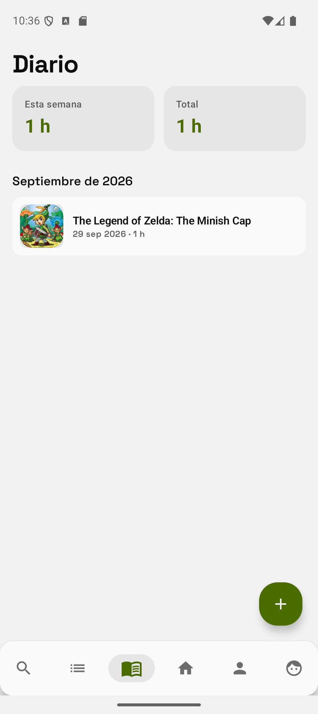 |
| Social (feed) | 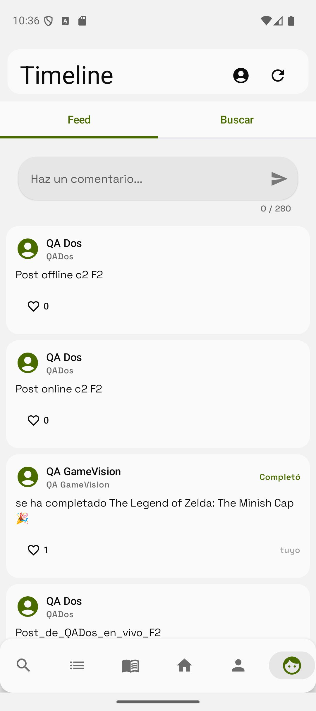 |
| Perfil | 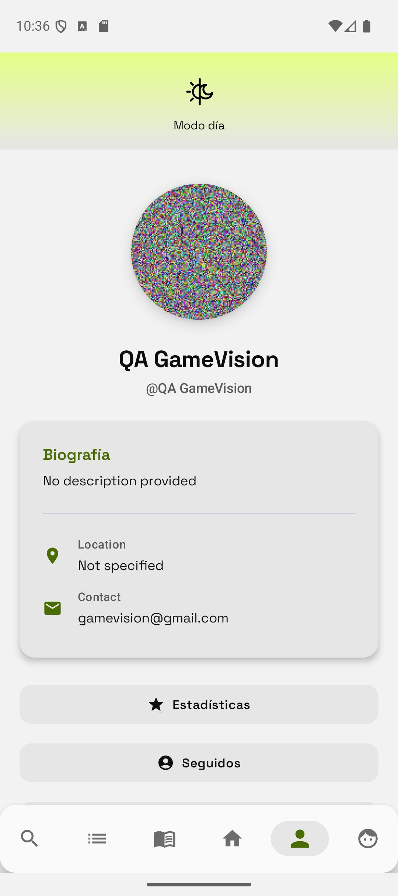 |
| Estadísticas | 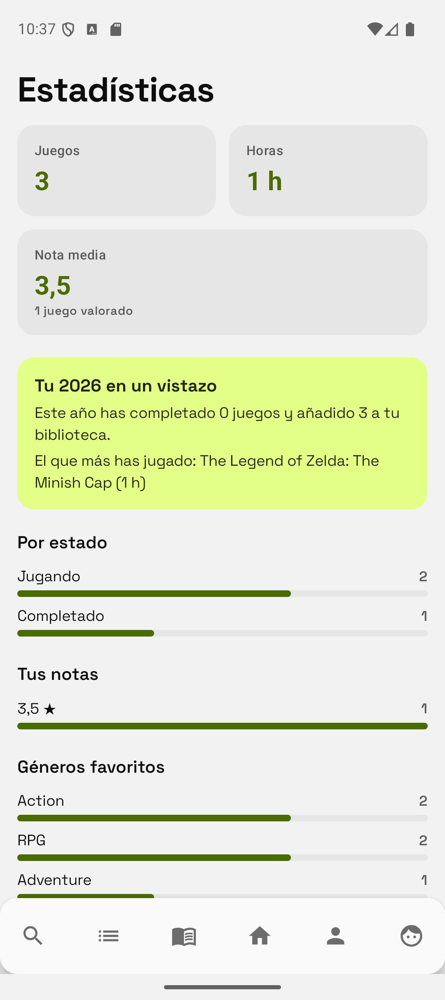 |

## Galería — modo oscuro

| Pantalla | Captura |
|---|---|
| Perfil | 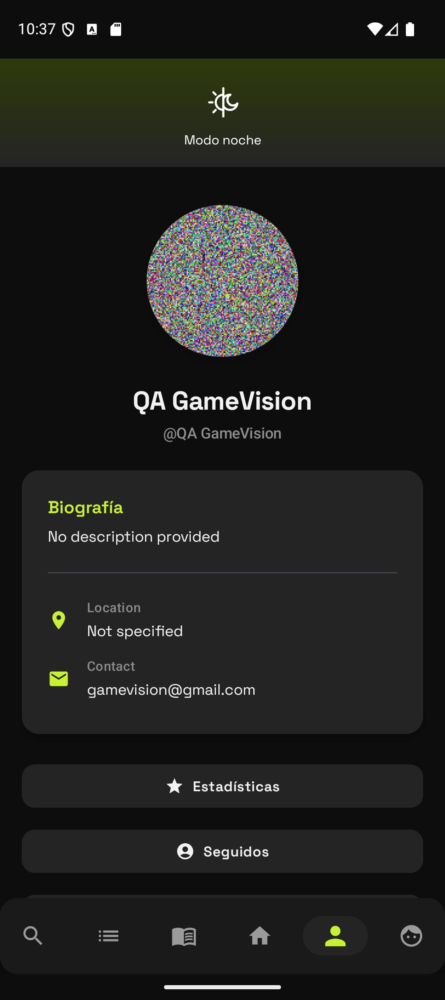 |
| Social (feed) | 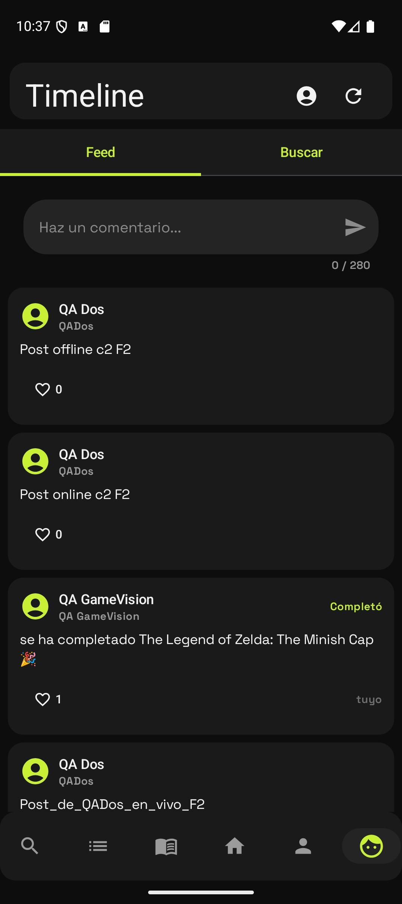 |
| Biblioteca | 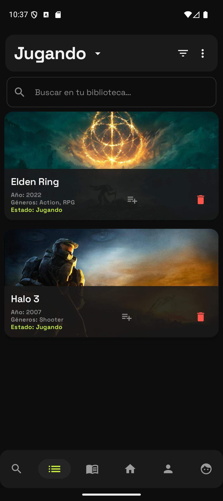 |

## Por qué se sustituye (memoria de la decisión)

- Contraste AA dudoso del verde ácido sobre claro (avisado en la investigación de 2026).
- El propietario decide en [ADR-0009](../metodologia/adr/0009-reanclaje-design-system.md) adoptar
  un sistema nuevo, y el 01/10 aporta la fuente (análisis del sistema Apple) →
  [ADR-0010](../metodologia/adr/0010-reanclaje-adelantado-fuente-recibida.md) adelanta el
  re-anclaje a antes de F3.
- El encaje comercial está argumentado dentro del ADR-0010 (cover art como protagonista, señal
  premium para ASO y el premium de 15-25 $/año).

*Capturas tomadas en el emulador Pixel 9 (API 36) con la cuenta QA el 01/10/2026.*
